<p align="center">
  
</p>

<p align="center">
  <strong>macOS menu bar app. Point AI at a folder, describe a task, step away.</strong>
</p>

<p align="center">
  <a href="https://github.com/hr23232323/extra-hands/releases"></a>
  <a href="https://github.com/hr23232323/extra-hands/blob/main/LICENSE"></a>
  <a href="https://openrouter.ai"></a>
  <a href="https://github.com/hr23232323/extra-hands/stargazers"></a>
</p>

<p align="center">
  <a href="#getting-started"><strong>Get Started</strong></a> ·
  <a href="#how-it-works"><strong>How It Works</strong></a> ·
  <a href="#whats-working"><strong>Status</strong></a> ·
  <a href="CONTRIBUTING.md"><strong>Contributing</strong></a> ·
  <a href="https://github.com/hr23232323/extra-hands/issues/new?template=bug_report.md"><strong>Report a Bug</strong></a>
</p>

---

> **Early alpha.** Core agent loop works. Shell execution is next.

---

<!-- TODO: replace with actual screenshot -->
<!-- <p align="center">
  
</p> -->

## What it does

Most AI tools are conversational — you ask, it answers, you act. extra-hands skips the middle step.

Describe a task in plain language. The agent reads your files, reasons over them, writes outputs, and hands you the result. No cloud. No account. No conversation back-and-forth.

```
click menu bar icon → pick workspace folder → describe task → done
```

## How it works

The agent runs a tool loop: `list_dir → read_file → write_file`, repeating until the task is complete. You watch live tool steps and streaming output as it works. Follow up in the same thread or start a new one.

All file operations go through Rust. The webview never touches the filesystem directly. Paths are resolved deterministically in code — the model is never trusted to construct absolute paths (`boxPath()` in `app.js` neutralizes any traversal attempts).

---

## Getting started

**Requirements:** macOS, Rust, [Tauri CLI v2](https://tauri.app/start/prerequisites/), an [OpenRouter](https://openrouter.ai) API key.

```bash
git clone https://github.com/hr23232323/extra-hands
cd extra-hands
make setup   # install Tauri CLI
make dev     # hot-reload dev build
make build   # production .app
```

No npm. No bundler. Frontend is plain HTML/CSS/JS in `frontend/` — edit and the dev server picks it up instantly.

**First launch:** Open Settings (gear icon) → paste your OpenRouter key → pick a workspace folder → describe a task.

---

## What's working

| Feature | Status |
|---|---|
| `list_dir`, `read_file`, `write_file` tools | ✅ |
| Streaming markdown + live tool step replay | ✅ |
| Per-folder permission prompts (deny / allow / always) | ✅ |
| Thread history — persistent, searchable, resumable | ✅ |
| Follow-up messages in the same thread | ✅ |
| Auto-generated thread titles | ✅ |
| Model switching (any OpenRouter model) | ✅ |
| Dark mode | ✅ |
| Shell / command execution | 🔜 next |
| `delete_file`, `move_file`, `search_files` | 🔜 planned |
| Binary file support | 🔜 planned |
| Background execution (window must stay open) | 🔜 planned |
| Packaged binary — build from source for now | 🔜 planned |

---

## Stack

| | |
|---|---|
| Shell | Tauri 2.x (Rust) |
| Frontend | Vanilla JS, no bundler |
| AI | OpenRouter — model-agnostic, BYOK |
| Storage | `tauri-plugin-store` — local JSON, no server |
| Markdown | `streaming-markdown` |

Fully local-first. No telemetry. No extra-hands servers.

---

## Project layout

```
frontend/
  app.js      — views, agent loop, chat rendering
  search.js   — OpenRouter streaming + SSE parsing
  state.js    — state + Tauri IPC persistence
  style.css
  index.html

src-tauri/
  src/lib.rs  — file I/O, folder picker, store, tray
```

**Adding a new tool:** add a `#[tauri::command]` fn in `lib.rs`, register it in `invoke_handler!`, then add a tool definition + handler in `executeTool()` in `app.js`. That's the whole loop.

---

## Screenshots

To capture screenshots of the running app:

```bash
make dev                    # in one terminal
./scripts/screenshot.sh     # in another — follow the prompts
```

---

## Contributing

See [CONTRIBUTING.md](CONTRIBUTING.md). Keep PRs focused — one thing per PR.

---

## License

MIT — see [LICENSE](LICENSE).
